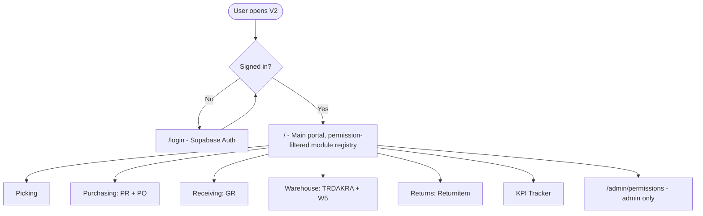
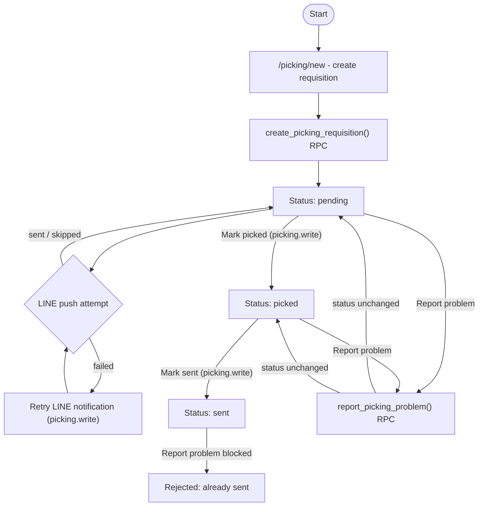
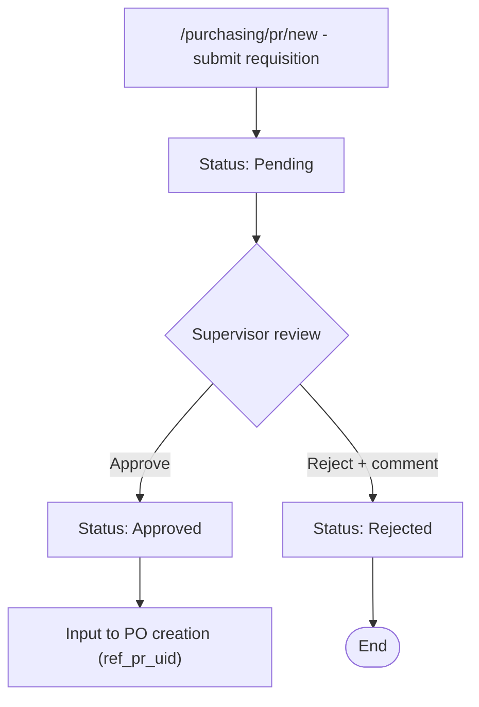
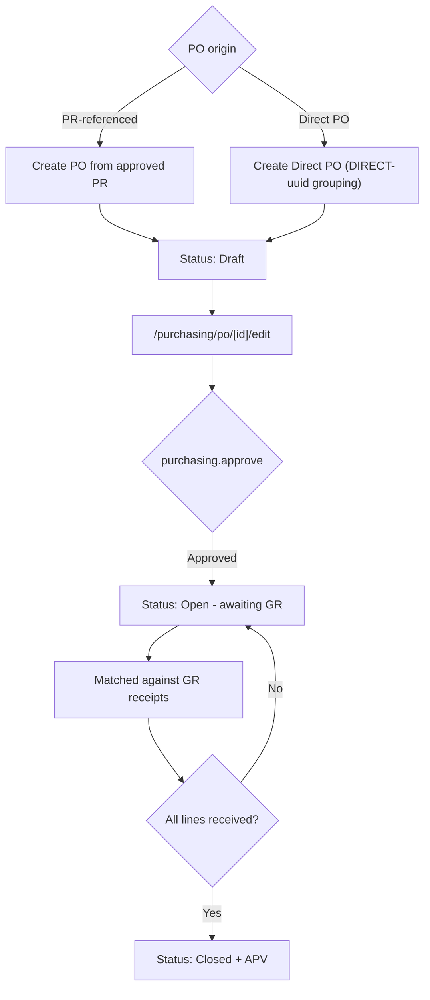
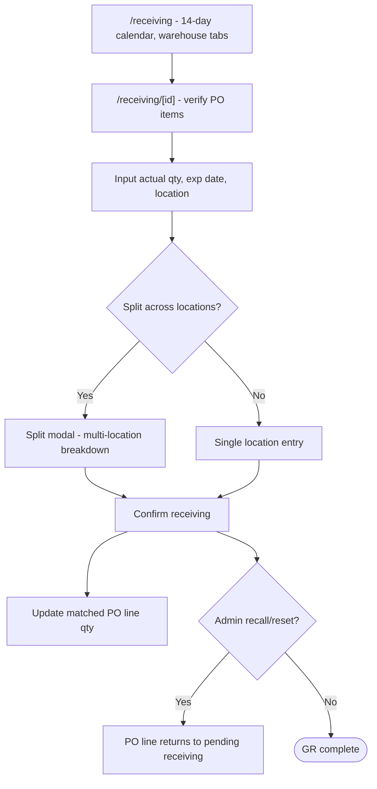
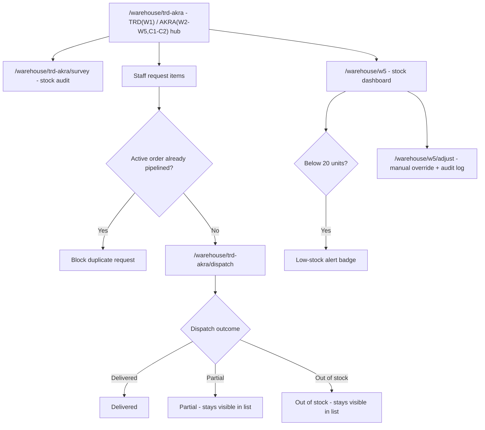
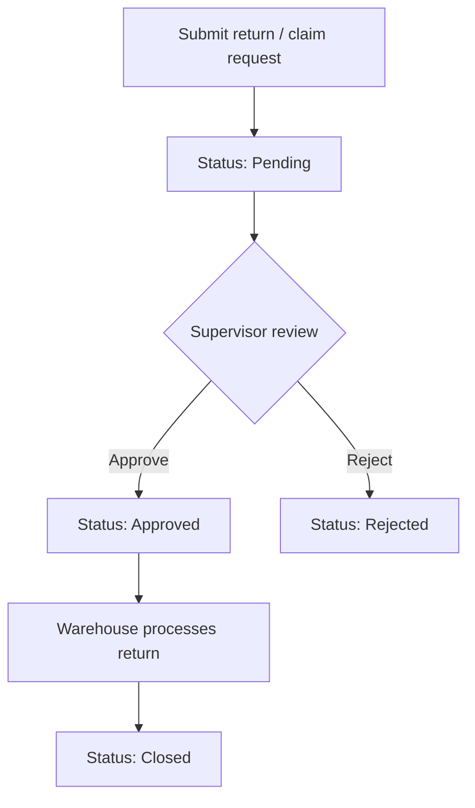

# V2 App Flow Diagrams (Mermaid)

Plan: `V2-0042`. Basic per-app flow diagrams for all 8 V2 modules, written for
pasting into [Mermaid Live](https://mermaid.live) (paste one code block at a
time into the Code panel there).

Each section states implementation status as of 2026-06-23 so the diagram
isn't mistaken for proven behavior where it is actually planned/mockup-only.

## 1. Overview - Main Portal / Module Registry

Status: Implemented and verified against staging (`V2-0017`).

## 2. Picking

Status: Implemented and verified against staging (`V2-0019`, `0020`, `0023`,
`0025`, `0027`). Cutover to production not yet approved (`V2-0034`).

## 3. Purchasing - PR (Purchase Requisition)

Status: Schema/RLS foundation only (`V2-0036`, migration `0013`). No data
import, RPC, or UI yet. Flow below reflects the planned spec
(`V2-0032`, `V2-0037` mockup).

## 4. Purchasing - PO (Purchase Order)

Status: Schema/RLS foundation only (`V2-0036`, migration `0013`). No data
import, RPC, or UI yet. Flow below reflects the planned spec
(`V2-0032`, `V2-0033` mockup).

## 5. Receiving - GR (Goods Receipt)

Status: Schema/RLS foundation only (`V2-0036`, migration `0013`). No data
import, RPC, or UI yet. Flow below reflects the planned spec
(`V2-0032`, `V2-0035` mockup).

## 6. Warehouse - TRDAKRA + W5

Status: Placeholder route only (permission-guarded, `V2-0041`), no schema or
UI content yet. Flow below reflects the planned spec (`V2-0032`).

## 7. Returns (Returnitem)

Status: Placeholder route only (permission-guarded, `V2-0041`), no schema, UI,
or mockup yet. Flow below is a generic placeholder based on
`docs/migration/module-inventory.md`'s description only - treat as
lowest-confidence diagram in this set, expect revision once a mockup/plan
exists.

## 8. KPI Tracker

Status: Placeholder route only (permission-guarded, `V2-0041`), no schema yet.
Flow below reflects the planned spec (`V2-0032`, `V2-0038` mockup).

```mermaid
flowchart TD
    DailyInput["/kpi/admin - supervisor inputs daily records (kpi.admin)"] --> Store["kpi_records"]
    Store --> Dashboard["/kpi - dashboard, trend charts"]
    Dashboard --> Targets{"Meets target?"}
    Targets -->|"Yes"| Green["Green metric card"]
    Targets -->|"No"| Red["Red metric card"]
    Store --> Config["kpi_configs - target thresholds (kpi.admin only)"]
```

## Status Legend

| Module | Status |
| --- | --- |
| Main / Auth | Implemented, verified staging |
| Picking | Implemented, verified staging; cutover not approved |
| Purchasing PR/PO, Receiving GR | Schema/RLS only (`0013`); flow is planned spec, unproven |
| Warehouse, Returns, KPI | Placeholder route + permission guard only; flow is planned spec or generic |
